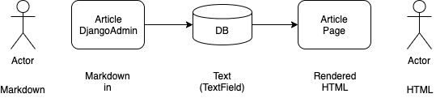

# Setup

## Install packages

The workshop author has this setup:

* [pyenv](https://github.com/pyenv/pyenv) - make sure you have it setup on your machine
* Python version `3.7.2`, with `pyenv`: 

```
pyenv install 3.7.2  # if not installed
pyenv virtualenv 3.7.2 djmdenv  # create virtualenv "pydayenv"
pyenv activate djmdenv  # activate pydayenv
pip install -r requirements.txt
```

* Ensure your `pip freeze` output includes the packages below (might contain more, but these are the ones required for this workshop session):

```
Django==2.2.6
TODO
```

## Create Django Project and Run Dev Server

```
django-admin startproject djmd
cd djmd
./manage.py runserver
```

* Check that you see the Django project homepage at `http://localhost:8000/`
  * cross-OS instructions on how to run the local Django dev server can be found [here](https://docs.djangoproject.com/en/2.2/intro/tutorial01/).

# Problem Description

Article has a `slug`, `title` and `content` fields. `content` field should accept markdown input. The article should render the markdown as HTML to the user:




# Action

## Part 1. Create article editor & Render article

* Create `articles` app:
* 
```
./manage.py startapp articles
```

* Add `articles` to `settings.INSTALLED_APPS`

* Create `Article` model

```python
# articles/models.py
from django.db import models


class Article(models.Model):
    slug = models.SlugField()
    title = models.CharField(max_length=256)
    content = models.TextField()

    def __str__(self):
        return self.title
```

* Create migration + run all migrations + create admin user

```
./manage.py makemigrations articles -n article_model
./manage.py migrate
./manage.py createsuperuser
```

* Enable `Article` admin section

```python
# articles/admin.py
from django.contrib import admin

from articles.models import Article


class ArticleAdmin(admin.ModelAdmin):
    pass


admin.site.register(Article)
```

* `./manage.py runserver`
  * Create a test article, adding text in markdown format within `content` field. Sample test data:

| Field | Data |
|-------|------|
| Slug | `search-engines` |
| Title | `Search Engines` |
| Content | Copy paste from below: |

```
### Gimme an alternative to Google

In _my_ opinion that would be [DuckDuckGo](https://duckduckgo.com/). I've been **too lazy** to switch.

**Lorem Ipsum** is simply dummy text of the printing and typesetting industry. Lorem Ipsum has been the industry's standard dummy text ever since the 1500s, when an unknown printer took a galley of type and scrambled it to make a type specimen book. It has survived not only five centuries, but also the leap into electronic typesetting, remaining essentially unchanged. It was popularised in the 1960s with the release of Letraset sheets containing Lorem Ipsum passages, and more recently with desktop publishing software like Aldus PageMaker including versions of Lorem Ipsum.
```


* Render article detail view
  * Add `ArticleDetailView` to `articles/views.py` of type `DetailView`
  * Docs on `DetailView` [here](https://docs.djangoproject.com/en/2.2/ref/class-based-views/generic-display/#detailview)
  * Automatically renders to template `articles/templates/articles/article_detail.html`, therefore:

```
$ mkdir -p articles/templates/articles
$ vim articles/templates/articles/article_detail.html
```

And paste:

```
<!-- templates/article_detail.html -->
<html>
	<head>Articles: {{ object.title }}</head>
<body>
    <h1>{{ object.title }}</h1>
    {{ object.content }}
</body>
</html>
```

Your `articles/views.py` should look like this:

```
# articles/views.py
from django.views.generic import DetailView

from articles.models import Article


class ArticleDetailView(DetailView):
    model = Article
```

Add the view to the `urls.py` config:

```
# urls.py

...

from articles.views import ArticleDetailView

urlpatterns = [
    path(
        'articles/<slug:slug>/',
        ArticleDetailView.as_view(), name='article_detail'),
    path('admin/', admin.site.urls),
]
```

Finally enhance your `Article` model by adding the handy `get_absolute_url` function to `articles/models.py`:

```
from django.urls import reverse

class Article(..):
    ...

    def get_absolute_url(self):
        return reverse('article_detail', kwargs={'slug': self.slug})
```

* Refresh the admin and you should now see the `View on Site` button (open in a new tab)

### Part 1: Checkpoint
* You should see the article rendered after entering it via admin.


## Part 2: Static Files
To set up local server for serving static files:

* Set the `STATIC_ROOT` setting

```
PROJECT_ROOT = os.path.dirname(os.path.abspath(__file__))
STATIC_ROOT = os.path.join(PROJECT_ROOT, 'static')
```

Add the below code to your `urls.py` (docs reference [here](https://docs.djangoproject.com/en/2.2/howto/static-files/#serving-static-files-during-development)):


```
from django.conf import settings
from django.conf.urls.static import static

urlpatterns = [
    # ... the rest of your URLconf goes here ...
]

if settings.DEBUG:  # local development
    urlpatterns = urlpatterns + static(
        settings.STATIC_URL, document_root=settings.STATIC_ROOT)
```


### Part 2: Checkpoint

Run the below command, and get static files copied to your `djmd/static` directory.

```
$ ./manage.py collectstatic

119 static files copied to '/Users/jv/dev/pyday/djmd/djmd/static'.
```


## Part 3: Markdown editor + preview
Enable a Markdown editor with preview in the Django admin.


* Ensure you have `markdownx` installed

```
$ pip freeze | grep markdownx
django-markdownx==2.0.28
```

* Expose `markdownx` URLs by adding them to your `urls.py` config:

```

```

  * Run command to relocate ("copy" in this case) static files to a place where your local dev server can serve them

```
$ ./manage.py collectstatic
```


### Part 3: Checkpoint
* Article admin accepts markdown, showing preview as you along.

## Part 4: Render Markdown as HTML to end user
* Rendering the Markdown as HTML to the end user
* `autoescape` docs [here](https://docs.djangoproject.com/en/2.2/ref/templates/builtins/#autoescape)

### Part 4: Checkpoint
* Your article's markdown content renders as HTML.


